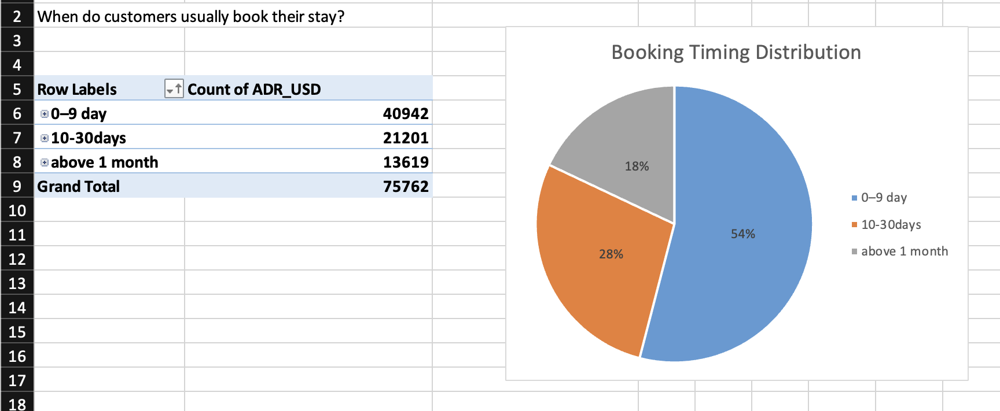
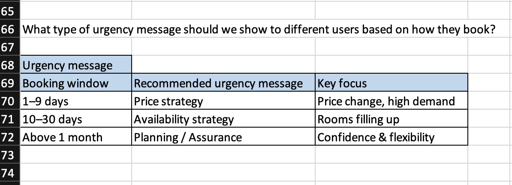

# 📊 Agoda Urgency Message Analysis (Excel)

## Project Overview

This project analyzes hotel booking data to understand **when customers book their stays** and **how pricing and booking behavior change as the check-in date approaches**.
The objective is to identify **where urgency messaging is effective** and translate data insights into **clear, actionable business recommendations**.

This is a **Business Analyst–focused project**, centered on decision support rather than predictive modeling.

---

## Business Problem

Online travel platforms frequently use urgency messages (such as price pressure or limited availability cues) to encourage faster booking decisions. However, applying urgency messages to all users can reduce customer trust and cause message fatigue.

This analysis evaluates:

* When customers typically book before check-in
* How urgency messaging should differ by booking window
* Where urgency messaging adds value — and where it should be avoided

---

## Dataset

* Approximately **75,000 hotel booking records**
* Data from **5 cities**
* Key fields include booking date, check-in date, price (ADR), and accommodation type

---

## Tools Used

* **Microsoft Excel**

---

## Work Performed

* Cleaned and prepared raw booking data
* Created **business features** such as booking window, length of stay, and booking segments
* Used pivot tables and charts to analyze booking timing and pricing behavior
* Compared booking patterns across accommodation types

---

## Key Insights

* A majority of bookings occur **close to the check-in date**
* Prices tend to be **higher for short booking windows**
* **Hotels** show stronger urgency-related pricing patterns

---

## 📈 Booking Window Distribution (Screenshot)

**Insight:**
Most customers book within a short time window before check-in, indicating that urgency messaging should be **targeted**, not universal.

---

## 🧭 Urgency Message Strategy Framework (Screenshot)

**Interpretation:**

* **1–9 days before check-in:** Price-based urgency (price changes, high demand)
* **10–30 days before check-in:** Availability-based urgency (rooms filling up)
* **Above 1 month:** No urgency; focus on planning confidence and flexibility

---

## Business Recommendations

* Apply urgency messages primarily to **short and medium booking windows**
* Use **price-based urgency** for last-minute bookings
* Use **availability-based messaging** for mid-range planners
* Avoid urgency messaging for early planners to maintain user trust
* Validate impact through a **controlled A/B test** before full rollout

---

## Next Steps

* Design and run an A/B test to measure conversion impact
* Segment results further by city and accommodation type

---

## Skills Demonstrated

* Business problem framing
* Excel-based data analysis
* Business feature engineering
* Insight synthesis and recommendation design
* Experimentation mindset (A/B testing concept)

