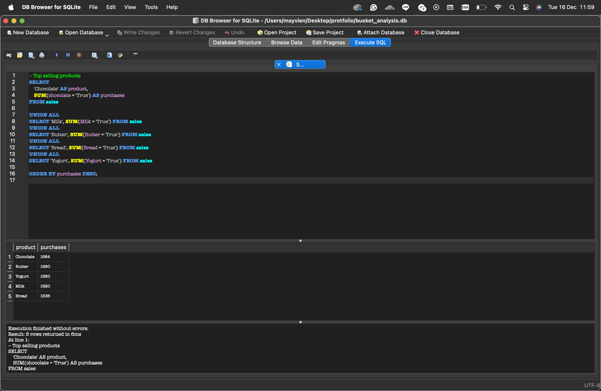
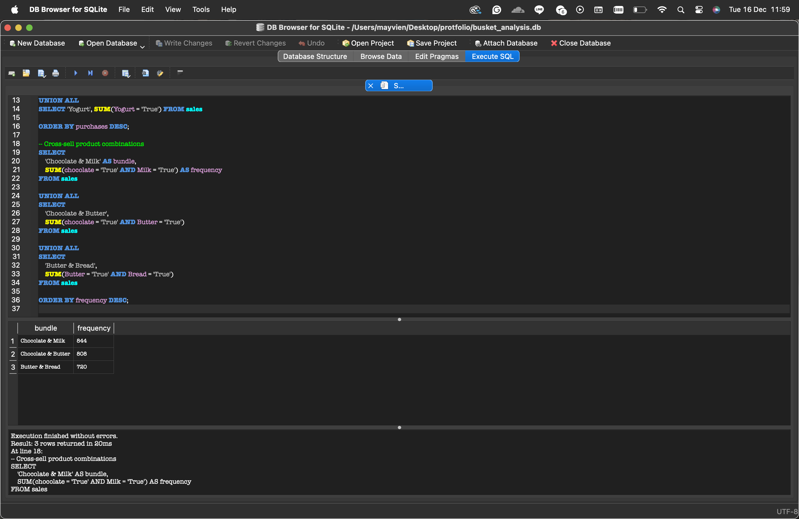

## 📌 Project Overview
This project analyzes retail transaction data to identify
top-selling products and frequently purchased product combinations.

## ❓ Business Question
- Which products sell the most?
- Which products are frequently bought together?
- How can this support cross-selling strategies?

## 🛠 Tools Used
- SQL (SQLite)
- DB Browser for SQLite
- GitHub

## 🔍 Analysis Steps
1. Created transaction-level sales table
2. Queried top-selling products
3. Analyzed cross-sell product combinations

## 📊 Key Findings
- Chocolate and Milk are the top-selling products
- Chocolate & Milk is the most frequent product combination
- Butter & Bread also show strong cross-selling potential

## 💡 Business Recommendations
- Bundle Chocolate & Milk promotions
- Place Butter & Bread near each other in-store
- Offer combo discounts to increase basket size

## 📸 Screenshots

